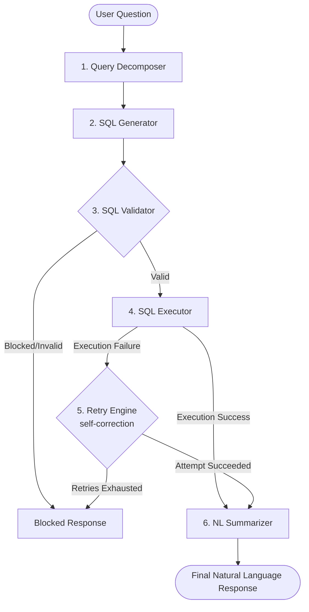

# Architecture Overview

The Text-to-SQL system leverages an agentic multi-stage pipeline that translates user questions into safe, optimized PostgreSQL queries, executes them, corrects errors dynamically (self-correction loop), and summarizes the final results in natural language.

---

## Pipeline Flow

The diagram below outlines how a user request traverses the pipeline components:

---

## Core Components

### 1. Query Decomposer (`app/services/decomposer.py`)
- **Purpose**: Translates fuzzy natural language requests into structured intent blocks.
- **How it works**: Queries `gemini-2.5-flash` with a prompt template that extracts the target columns, tables to query, filters to apply, and logical join paths. It returns a JSON structure.
- **Why it matters**: Feeding structured metadata into the SQL generation phase increases accuracy, especially for complex analytical queries requiring joins.

### 2. SQL Generator (`app/services/sql_generator.py`)
- **Purpose**: Generates valid PostgreSQL query syntax.
- **How it works**: Combines the original user question with the structural analysis block produced by the decomposer. It renders these inside `app/prompts/sql_generation_prompt.txt` and calls the Gemini API to get a SQL statement.
- **Why it matters**: It isolates the complexity of SQL generation by leveraging schema descriptions and structured context.

### 3. SQL Validator (`app/services/validator.py`)
- **Purpose**: Protects the database against SQL injections and unwanted side-effects.
- **How it works**: 
  - Sanitizes the output of the LLM (removes markdown fences).
  - Inspects query syntax for malicious keywords: `DELETE`, `DROP`, `UPDATE`, `INSERT`, `TRUNCATE`, `ALTER`, `CREATE`, `REPLACE`.
  - Enforces read-only behavior by validating that the query starts with `SELECT`.
- **Why it matters**: Security boundary. It blocks execution before the query hits the database.

### 4. SQL Executor (`app/services/executor.py`)
- **Purpose**: Runs queries on the PostgreSQL server.
- **How it works**: Opens a connection using SQLAlchemy and runs raw SQL. It extracts query results, maps rows into a clean dictionary list format, and collects performance metrics (elapsed execution time).
- **Why it matters**: Decouples query execution and database session management from LLM logic.

### 5. Retry Engine (`app/services/retry_engine.py`)
- **Purpose**: Implements a self-healing loop for broken SQL syntax or database errors.
- **How it works**: If the executor throws a PostgreSQL driver exception (e.g., column does not exist, syntax error), the Retry Engine captures the error message, the invalid SQL, and the original question. It feeds them back to Gemini via `app/prompts/retry_prompt.txt` to seek correction. It loops up to `max_retries` times (defaulting to 3 in agentic mode).
- **Why it matters**: Dramatically improves overall system robustness. Minor syntax errors (like mismatched casing or missing quotes) are self-healed without user intervention.

### 6. Natural Language Summarizer (`app/services/summarizer.py`)
- **Purpose**: Formulates a user-friendly conversational response.
- **How it works**: Takes the original question, the executed SQL query, and a sample of the returned rows. It feeds them to Gemini to render a natural sentence summarizing the results.
- **Why it matters**: Provides the user with a conversational response, rather than just returning raw tabular data.
