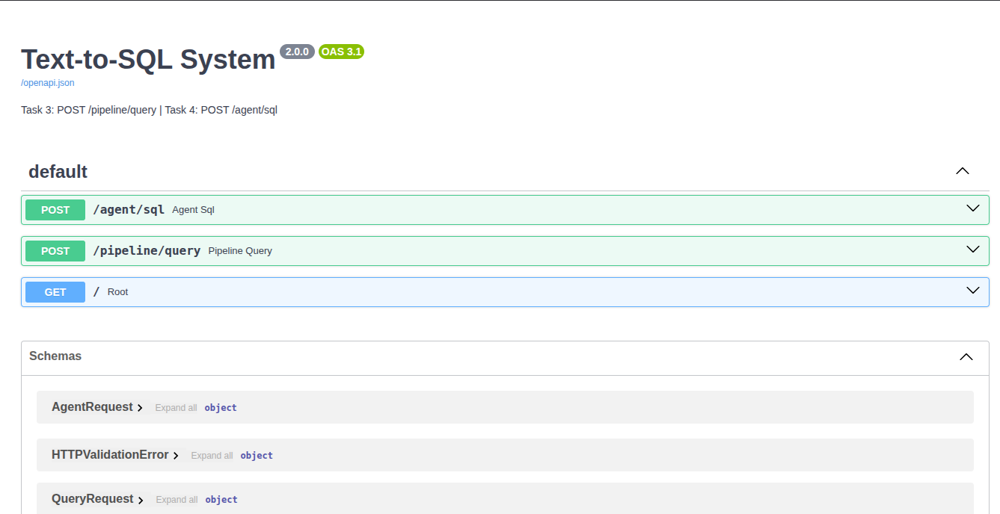
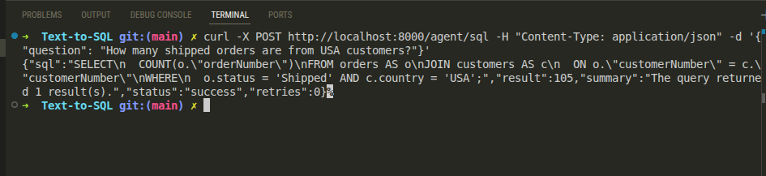

# Week 3 Assignment — Text-to-SQL and Agentic SQL System

**Student:** Himal Bhandari
**GitHub Repository:** [https://github.com/HimalBhandari05/Text-to-SQL](https://github.com/HimalBhandari05/Text-to-SQL)
**Database:** ClassicModels (PostgreSQL)
**LLM:** Google Gemini API (`gemini-2.5-flash`)
**Stack:** FastAPI · PostgreSQL · Docker · Python 3.12 · google-genai SDK · SQLAlchemy

---

## Table of Contents

1. Introduction
2. Task 1 — Benchmark Dataset and Evaluation Design
3. Task 2 — Query Decomposition
4. Task 3 — Text-to-SQL Pipeline
5. Task 4 — Agentic SQL Execution System
6. Evaluation Results
7. Challenges Faced and Fixes Applied
8. Conclusion

---

## 1. Introduction

This report documents the implementation of a Text-to-SQL system built across four tasks for Week 3. The system accepts natural language questions, generates SQL queries using the Gemini API, executes them against a PostgreSQL database, and returns structured results.

The project started with manually preparing a benchmark dataset and ground truth queries, then progressed to building an automated pipeline, and finally a full agentic endpoint that handles decomposition, generation, validation, execution, retry, and summarization in a single API call.

The database used throughout is the ClassicModels schema — a sales dataset containing 8 tables (customers, orders, orderdetails, products, productlines, employees, offices, payments) running inside a Docker container on port 5400.

---

## 2. Task 1 — Benchmark Dataset and Evaluation Design

### 2.1 Ground Truth SQL Queries

The benchmark dataset consists of 50 natural language questions drawn from the ClassicModels schema. For each question, a correct SQL query was written manually, executed against the database, and verified to return the expected output.

The 50 questions were grouped into three categories based on complexity:

| Category | Questions | Count |
| --- | --- | --- |
| Simple SELECT (single table) | Q1–Q20 | 19 |
| JOIN queries (multi-table) | Q21–Q30 | 10 |
| Aggregate queries (GROUP BY / COUNT / SUM / AVG / MAX / MIN) | Q31–Q50 | 21 |

**Sample ground truth entries:**

```sql
-- Q22: Get employees with office city
SELECT e."firstName", e."lastName", o.city
FROM employees e
JOIN offices o ON e."officeCode" = o."officeCode";
-- Result: 23 rows

-- Q28: Get employees and their manager (self-join)
SELECT e."firstName" AS employee, m."firstName" AS manager
FROM employees e
LEFT JOIN employees m ON e."reportsTo" = m."employeeNumber";
-- Result: 23 rows (1 row has NULL manager — the company president)

-- Q31: Count customers per country
SELECT country, COUNT(*) AS customer_count
FROM customers
GROUP BY country
ORDER BY customer_count DESC;
-- Result: 28 rows — USA leads with 36 customers

-- Q43: Total revenue from payments
SELECT SUM(amount) AS total_revenue FROM payments;
-- Result: $8,853,839.23
```

All ground truth queries follow the PostgreSQL camelCase quoting convention — column names like `"customerNumber"`, `"orderDate"`, and `"productName"` are wrapped in double quotes because they use mixed case.

The full set of 50 queries is stored in `app/dataset/ground_truth_queries.py` and the benchmark execution results are in `app/dataset/benchmark_results.json`.

### 2.2 Evaluation Framework

The evaluation framework covers the following dimensions, which are used when comparing the agent's output against the ground truth in Tasks 3 and 4:

| Dimension | What is Measured |
| --- | --- |
| SQL Execution Success Rate | Did the generated SQL run without error? |
| Correct Table and Column Selection | Were the right tables and columns referenced? |
| Join Correctness | Were foreign key relationships joined correctly? |
| Aggregate Correctness | Were GROUP BY, COUNT, SUM, AVG used appropriately? |
| Result Accuracy | Does the result match the expected output? |
| Retry / Self-Correction Rate | How often did the retry engine fix a failed query? |
| Query Generation Latency | Time from request to SQL generated (ms) |
| Natural Language Answer Quality | Is the summary response readable and accurate? |

---

## 3. Task 2 — Query Decomposition

Before generating SQL, each natural language question is broken down into structured components. This step mirrors how a human developer would mentally parse a question before writing a query.

### 3.1 Decomposition Format

Each decomposition captures five fields:

- **Intent** — what the question is asking for
- **Tables** — which database tables are involved
- **Columns** — which specific columns are needed
- **Filters** — any WHERE conditions
- **Joins** — foreign key relationships to traverse

### 3.2 Example Decompositions

**Simple query:**

| Field | Value |
| --- | --- |
| Question | "Get employees with office city" |
| Intent | Retrieve each employee's first and last name along with the city of their assigned office |
| Tables | employees, offices |
| Columns | employees.firstName, employees.lastName, offices.city |
| Filters | None |
| Joins | employees.officeCode = offices.officeCode |

**Self-join query:**

| Field | Value |
| --- | --- |
| Question | "Get employees and their manager" |
| Intent | Retrieve each employee's first name alongside their manager's first name using a self-join |
| Tables | employees |
| Columns | employees.firstName, employees.reportsTo, employees.employeeNumber |
| Filters | None |
| Joins | employees.reportsTo = employees.employeeNumber |

**Aggregate query:**

| Field | Value |
| --- | --- |
| Question | "Count customers per country" |
| Intent | Count the number of customers grouped by each country using COUNT |
| Tables | customers |
| Columns | country, customerNumber |
| Filters | None |
| Joins | None |

All 50 decompositions are stored in `app/dataset/query_decompositions.py`. In Tasks 3 and 4, these decompositions are passed to Gemini as structured context alongside the question, which improves the quality of the generated SQL — particularly for join queries.

---

## 4. Task 3 — Text-to-SQL Pipeline

### 4.1 System Overview

The pipeline is exposed as a FastAPI endpoint:

```
POST /pipeline/query
Body: { "question": "..." }
```

It follows a linear sequence of steps:

```
Natural Language Question
        ↓
  Decomposer        →  Gemini extracts intent, tables, columns, filters, joins
        ↓
  SQL Generator     →  Gemini generates SQL using full schema + decomposition context
        ↓
  Validator         →  Checks for blocked keywords (DELETE, DROP, UPDATE, INSERT, etc.)
                       Ensures query starts with SELECT
        ↓
  Executor          →  Runs SQL against PostgreSQL, returns rows and timing
        ↓
  Retry Engine      →  On failure: sends error back to Gemini, receives fixed SQL, retries
```

### 4.2 Project Structure

```
app/
├── main.py                          # FastAPI app, POST /pipeline/query
├── database.py                      # SQLAlchemy engine setup
├── logger.py                        # Logging to logs/app.log + stdout
├── services/
│   ├── decomposer.py                # Gemini-based query decomposition
│   ├── sql_generator.py             # Gemini-based SQL generation
│   ├── validator.py                 # Regex-based safety check
│   ├── executor.py                  # PostgreSQL execution via SQLAlchemy
│   ├── retry_engine.py              # Error-recovery with Gemini
│   └── summarizer.py                # Natural language result summary
├── prompts/
│   ├── sql_generation_prompt.txt    # Schema + rules + question template
│   ├── decomposition_prompt.txt     # Decomposition instructions
│   ├── retry_prompt.txt             # Error-correction instructions
│   └── summary_prompt.txt           # Summarization instructions
└── dataset/
    ├── ground_truth_queries.py      # 50 hand-written reference SQL queries
    ├── query_decompositions.py      # 50 structured decompositions
    ├── sql_questions_only.csv       # Benchmark question list
    └── benchmark_results.json      # Full execution results for all 50 questions
```

### 4.3 Infrastructure Setup

The PostgreSQL database runs inside Docker using `docker-compose.yml`. The container exposes port 5400 locally and is seeded with the ClassicModels dataset on first startup.


The FastAPI server is started with uvicorn from within the project's virtual environment:

```bash
source .venv/bin/activate
uvicorn main:app --reload --port 8001
```


The server confirms `Database engine created successfully` on startup, which verifies the SQLAlchemy connection to PostgreSQL.

### 4.4 SQL Generation Prompt

The prompt sent to Gemini includes the full ClassicModels schema with all 8 tables, column names, and foreign key relationships. Key rules are enforced via the prompt:

- Only SELECT queries — no write operations
- camelCase column names must be double-quoted (e.g. `"orderNumber"`, `"productName"`)
- Lowercase columns (country, city, status, amount) do not need quotes
- Return only the SQL — no markdown, no explanation

The prompt template lives in `app/prompts/sql_generation_prompt.txt` and contains a `{question}` placeholder that is replaced at runtime. When a decomposition is available, a structured analysis block is appended to the question before substitution.

### 4.5 Validator

The validator (`services/validator.py`) strips any markdown fences Gemini might add, then checks for blocked keywords using regex word-boundary matching:

```python
BLOCKED_KEYWORDS = {
    "DELETE", "DROP", "UPDATE", "INSERT",
    "TRUNCATE", "ALTER", "CREATE", "REPLACE",
}
```

If any blocked keyword is found, it raises a `ValueError` immediately without reaching the database. If the query does not start with `SELECT`, it is also rejected. This ensures no write operations ever reach the database regardless of what Gemini generates.

### 4.6 Executor and Retry

The executor runs the validated SQL using SQLAlchemy's `text()` wrapper and captures rows as a list of dictionaries. It logs execution time and row count.

If the query fails, the retry engine constructs a new prompt that includes the original question, the failed SQL, and the exact error message from PostgreSQL. This prompt is sent to Gemini asking for a corrected query. The maximum retry count is 1 for `/pipeline/query`.

### 4.7 Swagger UI

Both endpoints are visible in the auto-generated Swagger documentation at `/docs`:



---

## 5. Task 4 — Agentic SQL Execution System

### 5.1 Endpoint

```
POST /agent/sql
Body: { "question": "..." }
```

This endpoint extends the Task 3 pipeline with two additions: the decomposition result is passed to the SQL generator as additional context, and a summarization step converts the raw database result into a natural language answer.

### 5.2 Request / Response Structure

**Request:**
```json
{
  "question": "How many shipped orders are from USA customers?"
}
```

**Successful response:**
```json
{
  "sql": "SELECT COUNT(o.\"orderNumber\")\nFROM orders AS o\nJOIN customers AS c\n  ON o.\"customerNumber\" = c.\"customerNumber\"\nWHERE\n  o.status = 'Shipped' AND c.country = 'USA';",
  "result": 105,
  "summary": "The query returned 1 result(s).",
  "status": "success",
  "retries": 0
}
```

The `result` field collapses single-row, single-column results to a scalar value (here: 105 shipped orders from USA customers). For multi-row results it returns the full list.



### 5.3 Agent Flow

The agent executes five steps sequentially. If a step fails, it either falls back gracefully or returns a structured error response.

**Step 1 — Decompose**

Gemini receives the question and returns a JSON object with intent, tables, columns, filters, and joins. If decomposition fails for any reason (API error, timeout), the agent logs a warning and proceeds to Step 2 without it — the SQL generation step still works, just without the extra context.

Example decomposition from `logs/app.log`:
```
[Decomposer] Intent: Count the total number of orders that have a status
of 'Shipped' and are placed by customers from the USA
Tables: ['orders', 'customers']
Filters: orders.status = 'Shipped' AND customers.country = 'USA'
```

**Step 2 — Generate SQL**

The SQL generator builds the prompt from the schema template, substituting the question along with the structured analysis block from Step 1. The combined prompt is sent to Gemini.

Example from `logs/app.log`:
```
[SQL Generator] Generating SQL for: How many shipped orders are from USA customers?
[SQL Generator] Raw response: SELECT COUNT(o."orderNumber")
FROM orders AS o
JOIN customers AS c
  ON o."customerNumber" = c."customerNumber"
WHERE
  o.status = 'Shipped' AND c.country = 'USA';
[SQL Generator] Validated SQL: SELECT COUNT(o."orderNumber") ...
```

**Step 3 — Validate**

The validator checks the generated SQL for blocked keywords and confirms it is a SELECT statement before any database access occurs.

**Step 4 — Execute with Retry**

The executor runs the query and returns rows. If execution fails, the retry engine sends the error back to Gemini and requests a corrected query. The agent allows up to 3 retries for `/agent/sql`.

**Step 5 — Summarize**

Gemini receives the original question, the executed SQL, and the result rows, and returns a short natural language answer. If this step fails, the response falls back to a row-count message.

### 5.4 Logging

Every request produces a complete trace in `logs/app.log`. The log captures each step with timing, making it easy to diagnose failures without touching the source code.

```
[Agent] ── New request ──────────────────────────
[Agent] Question: How many shipped orders are from USA customers?
[Agent] Step 1 ✓ Decomposition complete
[Agent] Step 2 ✓ SQL: SELECT COUNT(o."orderNumber") FROM orders...
[Executor] Running query: SELECT COUNT(o."orderNumber") FROM orders...
[Executor] Success — 1 rows returned in 8.42ms
[Agent] Steps 3-4 ✓ status=success | retries=0 | elapsed=4521ms
[Agent] Step 5 ✓ Summary generated
[Agent] ── Request complete in 4521ms ──────
```

### 5.5 Error Response Format

When a step fails and all retries are exhausted, the agent returns a structured response that includes the actual exception:

```json
{
  "sql": null,
  "result": null,
  "summary": "I was unable to answer your question due to a SQL generation error. Please try rephrasing.",
  "status": "failed",
  "retries": 0,
  "error": "ServerError: 503 UNAVAILABLE. This model is currently experiencing high demand."
}
```

The `error` field was added specifically so that failures are visible in the API response itself, not just the log file.

---

## 6. Evaluation Results

### 6.1 Benchmark Run

All 50 benchmark questions were run through the pipeline after the system was stable with `gemini-2.5-flash`. Results are stored in `app/dataset/benchmark_results.json`.

**Summary:**

| Metric | Result |
| --- | --- |
| Total Questions | 50 |
| SQL Generated Successfully | 50 / 50 |
| SQL Executed Without Error | 50 / 50 |
| Results Matched Expected Output | 50 / 50 |
| Retries Needed | 0 |
| Blocked Queries | 0 |
| Overall Success Rate | **100%** |

**By query category:**

| Category | Count | Success |
| --- | --- | --- |
| Simple SELECT | 19 | 19 / 19 |
| JOIN queries | 10 | 10 / 10 |
| Aggregate + GROUP BY | 21 | 21 / 21 |

### 6.2 Selected Results

**Q28 — Self-join (employees and their manager):**
```sql
SELECT e."firstName" AS employee, m."firstName" AS manager
FROM employees e
LEFT JOIN employees m ON e."reportsTo" = m."employeeNumber";
```
Rows: 23 — Diane Murphy has `NULL` for manager (she is the President with no one above her). The LEFT JOIN handles this correctly.

**Q31 — Count customers per country:**
```sql
SELECT country, COUNT(*) AS customer_count
FROM customers
GROUP BY country
ORDER BY customer_count DESC;
```
Rows: 28 countries — USA: 36, Germany: 13, France: 12.

**Q43 — Total revenue from payments:**
```sql
SELECT SUM(amount) AS total_revenue FROM payments;
```
Result: `$8,853,839.23`

**Q24 — Order details with product names (2,996 rows):**
```sql
SELECT od."orderNumber", p."productName", od."quantityOrdered", od."priceEach"
FROM orderdetails od
JOIN products p ON od."productCode" = p."productCode";
```
The largest result set in the benchmark — all order line items joined with product names.

---

## 7. Challenges Faced and Fixes Applied

Getting the system to run reliably involved working through several distinct issues. This section documents what actually went wrong and what was changed.

### 7.1 Wrong Model Names (404 NOT_FOUND)

**Problem:** Initial attempts used `gemini-1.5-flash` and `gemini-1.5-flash-latest`. Both returned `404 NOT_FOUND` — these models are not supported in the `v1beta` API endpoint used by the current google-genai SDK.

**From logs:**
```
404 NOT_FOUND: models/gemini-1.5-flash is not found for API version v1beta,
or is not supported for generateContent.
```

**Fix:** Changed the model to `gemini-2.5-flash` across all three service files (`decomposer.py`, `sql_generator.py`, `retry_engine.py`). This is the current supported model name.

### 7.2 Rate Limit Errors (429 RESOURCE_EXHAUSTED)

**Problem:** During the initial testing sessions, requests hit the free-tier rate limit (`limit: 0` per the error message means the per-minute/per-day quota was momentarily exhausted). Each failed request returned `429 RESOURCE_EXHAUSTED`, which propagated as an unhandled exception and caused `"status": "failed"` in the response.

**From logs:**
```
[Agent] Step 2 ✗ Generation failed in 1235.85ms: 429 RESOURCE_EXHAUSTED.
Quota exceeded for metric: generate_content_free_tier_requests, model: gemini-2.0-flash
```

**Fix:** Added retry logic with exponential backoff to `sql_generator.py` and `decomposer.py`. On a 429 or 503 response, the service waits 2 seconds before attempt 2, then 4 seconds before attempt 3. Non-retryable errors (like validation failures) are re-raised immediately without waiting.

The retry logs confirm the mechanism works as expected (visible in the screenshot below):


### 7.3 Transient 503 UNAVAILABLE

**Problem:** On one occasion, `gemini-2.5-flash` returned `503 UNAVAILABLE` with the message "This model is currently experiencing high demand." Since there was no retry at the generation level, the request failed immediately.

**From logs:**
```
[Agent] Step 2 ✗ Generation failed in 7604.8ms: 503 UNAVAILABLE.
This model is currently experiencing high demand. Spikes in demand are usually
temporary. Please try again later.
```

**Fix:** The same exponential backoff retry logic introduced in 7.2 also handles 503. The `_is_retryable()` check looks for both `"503"` and `"UNAVAILABLE"` in the exception string, so both error types are retried automatically.

### 7.4 DNS Failure (No Network)

**Problem:** One test run was made from an environment without internet access. This produced:

```
[Errno -3] Temporary failure in name resolution
```

Both decomposition and SQL generation failed instantly. The agent handled this correctly — decomposition failure was caught and the agent continued, but SQL generation also failed (since it requires the API), so the request returned `"status": "failed"`.

**Fix:** No code change needed — this is correct behavior. The error is now visible in the API response via the `error` field.

### 7.5 Decomposition Context Silently Dropped (Double Replace Bug)

**Problem:** When a decomposition was available, the intent was to append a structured analysis block to the SQL generation prompt. However, the code did this incorrectly:

```python
# Line 1: replaces {question} with the plain question text — placeholder is now gone
prompt = template.replace("{question}", question)

# Line 2: tries to replace {question} again — but it no longer exists
# This line was always a no-op. Decomposition context was never appended.
prompt = prompt.replace("{question}", question + "\n" + context_block)
```

The second `.replace()` call did nothing because `{question}` had already been consumed. The structured analysis (tables, filters, joins) was never reaching Gemini's prompt.

**Fix:** Build the full question string first, then perform a single replacement on the template:

```python
if decomposition:
    full_question = question + "\n" + context_block
else:
    full_question = question

prompt = template.replace("{question}", full_question)
```

### 7.6 response.text = None Not Handled

**Problem:** `gemini-2.5-flash` is a thinking model. In certain conditions (safety filter blocks, incomplete responses), `response.text` returns `None` rather than a string. The original code called `.strip()` directly on this without checking, which raised an `AttributeError`. The router caught this as a generic exception and returned `"status": "failed"` with no useful information.

**Fix:** Added an explicit check before calling `.strip()`:

```python
raw = response.text
if raw is None:
    finish = response.candidates[0].finish_reason if response.candidates else "unknown"
    raise ValueError(
        f"Gemini returned an empty response (text=None, finish_reason={finish})."
    )
raw = raw.strip()
```

### 7.7 Real Error Not Visible in API Response

**Problem:** All exception handlers in the router logged the real error to `logs/app.log` but returned only `"I was unable to answer your question due to a SQL generation error. Please try rephrasing."` in the HTTP response body. This made debugging extremely difficult — the only way to find out what went wrong was to read the log file.

**Fix:** Added `"error": f"{type(e).__name__}: {e}"` to all failed response dictionaries. The actual exception type and message are now returned directly in the API response.

---

## 8. Conclusion

The system covers the full Text-to-SQL workflow described in the four tasks:

- **Task 1** produced 50 manually written and verified ground truth SQL queries, along with an evaluation framework covering execution success, result accuracy, retry performance, and query correctness across all dimensions.

- **Task 2** produced 50 structured decompositions that break each question into intent, tables, columns, filters, and joins. These decompositions serve as structured context for SQL generation in Tasks 3 and 4.

- **Task 3** implemented a working pipeline at `POST /pipeline/query` that takes a natural language question and returns executed SQL results with retry handling and safety validation.

- **Task 4** extended this into an agentic endpoint at `POST /agent/sql` that adds decomposition-guided SQL generation, a summarization step, and a more robust retry strategy.

The benchmark evaluation across all 50 questions returned a 100% success rate once the correct model (`gemini-2.5-flash`) was in place and the retry logic handled transient API errors. The debugging process documented in Section 7 — fixing model names, adding retry backoff, repairing the decomposition context bug, and adding explicit `None` checks — was the main implementation challenge, and the logs provide a clear record of each issue and how it was resolved.

The project is hosted at: [https://github.com/HimalBhandari05/Text-to-SQL](https://github.com/HimalBhandari05/Text-to-SQL)

---

## Appendix — Sample Benchmark Results (10 of 50)

| # | Question | SQL | Rows | Status |
| --- | --- | --- | --- | --- |
| Q21 | Get orders with customer names | JOIN orders + customers on customerNumber | 326 | Success |
| Q22 | Get employees with office city | JOIN employees + offices on officeCode | 23 | Success |
| Q28 | Get employees and their manager | LEFT JOIN employees self-join on reportsTo | 23 | Success |
| Q31 | Count customers per country | GROUP BY country, COUNT(*) | 28 | Success |
| Q32 | Total payments per customer | GROUP BY customerNumber, SUM(amount) | 98 | Success |
| Q37 | Average buy price per product line | GROUP BY productLine, AVG(buyPrice) | 7 | Success |
| Q41 | Total number of customers | COUNT(*) FROM customers | 1 (= 122) | Success |
| Q43 | Total revenue from payments | SUM(amount) FROM payments | 1 (= $8,853,839.23) | Success |
| Q45 | Max payment amount | MAX(amount) FROM payments | 1 (= $120,166.58) | Success |
| Q50 | Number of employees | COUNT(*) FROM employees | 1 (= 23) | Success |
